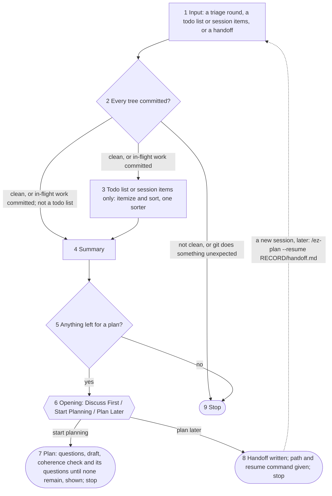

# The contract

What `ez-plan` does and what it writes. The rules it shares with `triage-review` — the unit, the
tree, agents, the groups, the sort, questions, records and commits — are in `references/shared.md`
and cited by ID. The step files carry out both; where a step file disagrees with either, the step
file is the defect.

## What it is for

It turns sorted work into decisions the owner can make: each broken down into an approachable
chunk, its consequences already analysed, put at the altitude the owner rules at (`Q3`). It never
decides for the owner what they did not rule on, and it never reviews its own work.

## The flow

Diamonds are the skill's decisions; hexagons are forks the owner decides. The opening's
recommendation and the planning questions are asked inside their nodes and not drawn. Discuss
First is an interrupt inside the opening, not a node.

## The rules

- **Z1. Inputs.** Exactly one of:
  1. **a handoff** (`--resume <path to handoff.md>`) written by an earlier `ez-plan` session or by
     `triage-review`.
     `RECORD` is its parent directory; the unit comes from `sort.md`'s round section. A handoff
     from `triage-review`'s diagnosis route names its report: the decision in its §3 and the owner's
     answers in its §11 are rulings, and the sorted items are inputs to the plan, not its
     requirements, because the report may have reframed them.
  2. **a todo list, a session's items, or diffuse context** — a file, pasted text, or what this
     session already holds. The owner reads every item.
  3. **a `triage-review` round** (`--round <RECORD>`), handed over by `triage-review` in the same
     session after it lands its trivial fixes. Two sorters and an arbitrator already sorted it.

  With `--resume`, the `--spec` paths are the handoff's and any other argument is a declared no-op;
  `--test` and `--since` are declared no-ops on every input. Say so rather than dropping one
  silently. `G1` runs on every input before anything else. A commit it makes on a handoff is a
  resume-time commit (`S2`).
- **Z2. The input-2 sort.** The session itemizes the input into `findings.md` and sorts it alone
  into `sort.md`, recording that one sorter sorted it and the owner reads every item (`S2`). A work
  item is wanted work, not a reviewer's proposal, so it is sorted into four categories rather than
  the five groups:
  1. **Mechanical** — one correct, obvious way to do it; isolated or a pattern, as group 1.
  2. **Requires additional design** — a decision, a requirement or an assumption stands between the
     item and the work: groups 2 and 3 together.
  3. **Suggestion** — the item may be worth doing; **the plan decides its scope**. Unlike a
     review's design suggestion, it is not set aside.
  4. **Not correct as written** — not correct or accurate as written: the sorter says why, as a
     group-5 refutation does, it is **mentioned to the owner** in the summary, and it **still needs
     their ruling** — dropped, or restated as work — with the planning questions (`Z10`).

  Elsewhere in this contract, groups 1, 2-3, 4 and 5 read as these four in order. There is no blind
  sorter and no arbitrator: that is what `triage-review` buys. Every item carries its command where
  it has sites; a claim that can be measured is measured. **Nothing lands before the owner rules**:
  autonomy to fix a worklist is `triage-review`'s, and only for findings two agents sorted.
- **Z3. The summary**, for someone who has not read the input. Every line is something the owner can
  mark wrong.
  1. What the artifact is for, on a document (`S1`).
  2. What is wrong or wanted, at altitude: design defects, assumptions and defect patterns as
     claims, not as a plan. On a large round, the state of the branch — the headline findings and
     the shape of what is wrong, general enough for a manager deciding the next sprint's direction
     and briefing an architect. **An empty set says so**: no design defects and no assumptions is
     said in as many words.
  3. What landed, one line each.
  4. Counts per group; group 4's count and every suggestion worth attention; group 5 by refutation.
  5. The sentence of counts about the input, verbatim; on a triage round that was fixes on fixes and
     not diagnosed, why not, from `sort.md`'s route.
  6. Where sorters disagreed, both readings and each command — **reported, never asked here**.
     Arbitrated conflicts are reported with their outcome, not re-opened.
  7. Carried sentences, verbatim.

  **On input 2 the summary lists every item**, its group and one line, because the owner reads every
  item. Then the opening, in the same message.
- **Z4. One plan.** If nothing is left for a plan — every item landed, or is group 4 or 5 on a
  triage round, or the owner declined it in a discussion — stop. On a triage round, suggestions are
  excluded from planning by default: they are reported, and one enters a plan only where it applies
  to the plan's goal or to its other items. On input 2 a suggestion is a scope decision, so it is
  left for a plan. Otherwise one plan, its
  goal in the owner's words. This gates every ending: the opening is where the work goes, not
  whether there is any. Where the plan is then executed is the owner's to say; no test decides it.
- **Z5. The opening.** Three options, the name the picker's label and the line its description,
  not restated beside the picker:
  - **Discuss First** — *discuss before deciding what to do*;
  - **Start Planning Here** — *walk through decisions, a subagent drafts* where a drafter will run
    (`Z9`), and otherwise the handoff menu's line, *walk through decisions, drafts here*;
  - **Plan Later in a New Session** — *saves a file to allow you to plan in a fresh session whenever
    you're ready*.

  **On a handoff the menu is two options** — offering to hand off again at once is a loop — though
  the owner may still ask for Plan Later after a discussion:
  - **Discuss First** — *talk through before planning*;
  - **Start Planning Now** — *walk through decisions, drafts here*.

  Recommend one, in this order — on a handoff, without the third test; the session recommends and
  does not decide:
  1. Would the owner be annoyed by planning machinery for something two turns of discussion and
     *"fix what we agreed on"* would settle → **Discuss First**.
  2. Would the design situation be hard to put as multiple choice, and devolve into a conversation
     held through the options' *"Other"* field → **Discuss First**. Do not judge by size.
  3. Is a fresh context wanted → **Plan Later**. Five reasons: this session has run long; the plan
     is large or will take many rounds of questions, where a drafter would run (`Z9`) — a subagent's
     cache lasts five minutes, so a drafter idle while the owner answers re-reads its whole context
     each round, and a handoff drafts without one; the owner wants to pick the planning up later;
     they want the agent that talks to them to draft the plan; or the conversation has got strange
     and deserves a stronger reset. The session judges the first two; the other three are the
     owner's to signal, so it names them and says it cannot tell.
  4. Otherwise → **Start Planning Here**.

  Where it is close, recommend Discuss First: it keeps the other two alive.
- **Z6. Discuss First is a breakpoint.** It writes the choice line (`Z8`) and yields the session to
  the owner. **Suspended:** the drafting checks (`Z10`), and transcribing the conversation into
  `owner.md` turn by turn — the owner chose to talk, and a question protocol run at them defeats
  that. **Still binding:** the shared contract, `Z11` and its gate, and the ability to resume
  planning. They are honoured, not announced. Inside the discussion the owner may ask for either
  planning option.
- **Z7. How a discussion ends.**
  - **A plan, here or later.** Everything the discussion settled goes to `owner.md` verbatim before
    any drafter is launched, and to `handoff.md` too where planning is later — a discussion that
    ends in a handoff is saved into the handoff, wherever it was opened. A planning question it
    clearly and unambiguously ruled is not asked again; an ambiguous or partial answer does not
    discharge one.
  - **Ad-hoc fixes**, on any input. They land under `Z11` and `C`; the run is
    marked **cancelled** in the choice line — no plan was appended, not that nothing happened — and
    the commits hold the intent. No `plan.md` and no new record file. The note-taking requirements
    are **suspended, not forbidden**: what is recorded is the agent's judgement and the owner's
    request, and the session may offer at any point to write something that is clearly a ruling to
    `owner.md`. Where fixes land as Artifact versions, the version's label is the only carrier.
  - **Only the planner writes `plan.md`.** The planning session may revise it — from the coherence
    check and the owner's feedback — until it is finalised (`K3`); the session executing it does
    not.
- **Z8. The choice line.** Each `ez-plan` session writes one line in `sort.md`, in two acts: the
  opening choice when it is taken, before yielding, and the outcome when the session ends — planned,
  handed off, stopped with nothing left, or `cancelled`. It stands incomplete for the length of a
  discussion. Where nothing is left for a plan, the opening is never offered and the line is written
  in one act. An earlier session's line is never overwritten.
- **Z9. Drafting.** The session drafts the plan itself when it is fresh or early — in its own
  judgement of its length — and always on a handoff. Where the plan comes after concrete work in the
  same session, a triage round's included, a drafter subagent writes it, because what it buys is
  independence from priors this session picked up; the owner may instead pick Plan Later. A drafter
  revises its own plan: answers go to it with `SendMessage`, and nobody edits the plan around it.
  Either way, the coherence check runs, and runs again after each batch of its questions until it
  finds nothing for the owner (`Z10`); each `--spec` path its member holds goes to the drafter and
  the check as a written criterion, never a source of plan items.
- **Z10. The drafting checks** govern the planning questions and nothing else. They are asked when
  planning begins, in whichever session, except the coherence check's (below): what counts as
  critical, in the owner's words, offered as concrete cases; acceptance, taste and
  missing-requirement questions; on input 2, the scope of each suggestion and a ruling on each item
  not correct as written; a sorter disagreement that would change what is done; and the goal,
  verbatim, where a derived goal is marked as the session's and offered for correction. **What the
  coherence check finds only the owner can rule on is asked before the plan is shown, until none
  remains**; the owner may defer one, and the plan lists it as deferred (the skill developer: *"ask
  the open questions until there aren't any remaining"*). Every question is drafted before any in
  its batch is asked, and the draft is checked against:
  1. Can a group of them be answered by one rule or principle? Ask about the rule instead.
  2. Does any have an obviously correct answer the owner is unlikely to rule against? Put those in
     bulk questions, the items numbered in the question's own text — never in the message above it,
     which the client may summarise, nor in an option's `preview`, which does not render on mobile.
     A question holds up to about eight items; more go in the call's other questions. Its options
     are approve all as written, or rule on some separately, the owner typing their numbers in
     Other; picked without numbers, ask which. Each item picked out is its own question in the next
     batch; the rest are approved as written.
  3. Where is a downstream conflict or an invented requirement likely? Ask about those on their own,
     even where the answer looks obvious.
  4. Would a manager be annoyed at being asked it? Decide it, and say what was decided.
- **Z11. The fix-all guard** stops the agent silently redesigning code in response to items the
  owner did not read. **On every input**, before a bulk fix inside a discussion lands, the session
  mentions the key design changes the owner has not already read; what was discussed and is known
  is just done. **Where agents sorted the items** (`S2`) — the owner did not read them — the full
  gate below applies as well:
  - **"Don't fix early" becomes a disclosure trigger, not a block.** Anything carrying the mark must
    be named at the gate, never folded into a count.
  - **A blanket "fix everything" resolves per group.** Group 1, applied. Group 2, applied at the
    session's discretion. Group 3, not applied and not silently skipped: each assumption is raised
    after the blanket has been applied. Groups 4 and 5, excluded.
  - **A summary and a confirmation come first**, before anything is applied. The gate is mandatory,
    and bounds the discretion over group 2. Its message ends the turn, and the owner's reply is the
    confirmation — never a question asked under it.
  - **Its grain:** every group-2 item, and everything marked "don't fix early", stated one by one in
    the session's own message. Mechanical fixes may be summarised by class. "Fixing 23 findings,
    confirm?" satisfies nothing.
  - **It asks about content and never for the same ruling twice.** Where the discussion already put
    each item to the owner one by one, with the design change or requirement addition it carries,
    and they ruled on each, state what will happen as a list to veto. Nothing reaches the tree that
    the owner was not shown, and where any such item exists the gate asks about those.
  - **The session may push back** on "fix everything" or on any pattern inside it — a permission,
    not a duty — and where it does not think a question is settled enough for the owner to defer,
    it says so rather than pick a side.
  - **A defect pattern met here is ruled on here**: fix every site or propose the higher-order fix —
    neither is forced, and *"no, just fix them"* stays a first-class answer — explained either way,
    with a final confirmation.
- **Z12. The list form.** A round with nothing to propose is planned as a list of questions and
  launches no drafter.
  - **Trigger:** the sort holds only groups 1 and 5 — plus design suggestions where both sorters
    agreed an item is one. A group 2 or group 3 item, or a group-4 item the sorters disagreed about,
    takes the round off this path. On input 2, only mechanical items and items not correct as
    written qualify: a suggestion there is a scope decision.
  - **What reaches it:** defect patterns; items marked "don't fix early"; and group-1 items inside
    the plan's reach.
  - **Form:** the session writes `plan.md` itself. Each defect pattern is put as the one question it
    already has — fix every site, or the proposal, fix every site the default. The rest is a list:
    per item the sites, the command, the fix, and the check that fails before it.
  - The trigger is read from `sort.md`, never from the session's own impression of the round. Where
    unsure, launch the drafter. **The coherence check still runs**, and the goal is still asked.
- **Z13. The handoff** carries the run's state, not the procedure: the resumed session loads this
  skill. It holds `sort.md` and `owner.md` by path, what landed, any `--spec` paths, what a
  discussion settled, and the session's own summaries marked as its own; it says at its head how it
  is resumed, that it is deleted once the plan is implemented, and that it should be cleaned up too
  where the work is done without a plan (`K4`). A later handoff from the
  same run appends to it.

## The files

In `RECORD` (`K1`): `findings.md` and `sort.md` on input 2 (`S2`); `owner.md` (`K3`), with each
session's questions and rulings under a heading naming the session — a picked option as its label,
its text marked as not the owner's; `plan.md`; `handoff.md` (`K4`).
