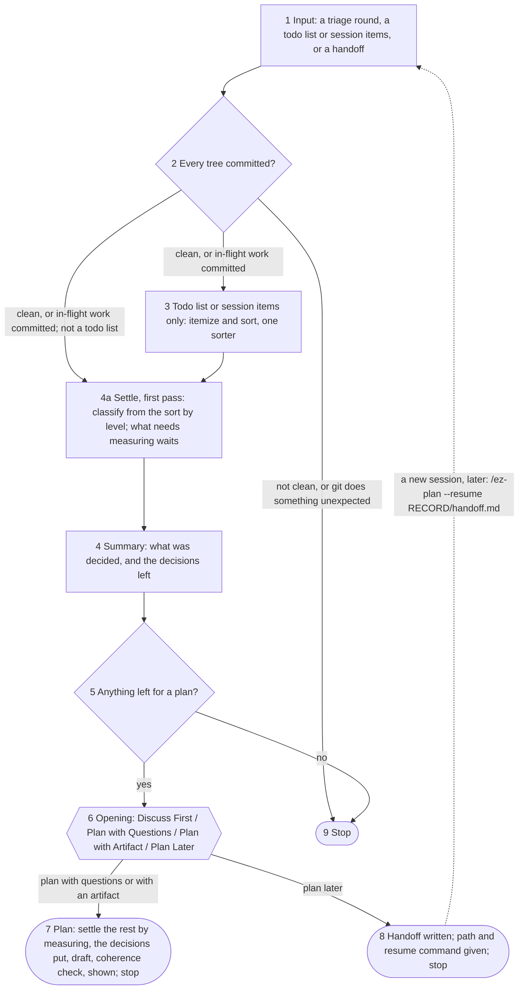

# The contract

What `ez-plan` does and what it writes. The rules it shares with `triage-review` — the unit, the
tree, agents, the groups, the sort, questions, records and commits — are in `references/shared.md`
and cited by ID. The step files carry out both; where a step file disagrees with either, the step
file is the defect.

## What it is for

It turns sorted work into one checked plan, and puts to the owner only the decisions that are
theirs: each broken down into an approachable chunk, its consequences already analysed, put at the
altitude the owner rules at (`Q3`). **Who decides follows the ladder** (`L`): what a rule, a
principle, a sibling or a check already settles, the agent decides and logs; what nothing settles,
and every level-5 fork, goes to the owner. The plan has value unread (the skill developer: *"the human
doesn't have to read the plan for the checking and organization of the plan to have value"*): it is
the checked log of what is done and why. It never reviews its own work.

## The flow

Diamonds are the skill's decisions; hexagons are forks the owner decides. The opening's
recommendation and the planning questions are asked inside their nodes and not drawn. Discuss
First is an interrupt inside the opening, not a node.

## The rules

- **Z1. Inputs.** Exactly one of:
  1. **a handoff** (`--resume <path to handoff.md>`) written by an earlier `ez-plan` session, or by
     `triage-review` before planning moved here. A `sort.md` without the "who sorted it" field came
     from `triage-review`: two sorters and an arbitrator sorted it.
     `RECORD` is its parent directory; the unit comes from `sort.md`'s round section.
  2. **a todo list, a session's items, or diffuse context** — a file, pasted text, or what this
     session already holds. The owner reads every item.
  3. **a `triage-review` round** (`--round <RECORD>`), with any open decisions the session carried
     in `RECORD/open-decisions.md` (`triage-review`'s `--decisions`), handed over by `triage-review`
     in the same session after it lands its settled fixes — or in a later session, where a
     diagnosis relay named it. Two sorters and an arbitrator already
     sorted it.

  With `--resume`, the `--spec` paths are the handoff's and any other argument is a declared no-op;
  `--test` and `--since` are declared no-ops on every input. Say so rather than dropping one
  silently. `G1` runs on every input before anything else. A commit it makes on a handoff is a
  resume-time commit (`S2`).
- **Z2. The input-2 sort.** The session itemizes the input into `findings.md` and sorts it alone
  into `sort.md`, recording that one sorter sorted it and the owner reads every item (`S2`). A work
  item is wanted work, not a reviewer's proposal, so it is sorted into four categories rather than
  the five groups:
  1. **Mechanical** — one correct, obvious way to do it; isolated or a pattern, as group 1.
  2. **Requires additional design** — a decision, a requirement or an assumption stands between the
     item and the work: groups 2 and 3 together.
  3. **Suggestion** — the item may be worth doing; **the plan decides its scope**. Unlike a
     review's design suggestion, it is not set aside.
  4. **Not correct as written** — not correct or accurate as written: the sorter says why, as a
     group-5 refutation does, it is **mentioned to the owner** in the summary, and it **still needs
     their ruling** — dropped, or restated as work — with the planning questions (`Z10`).

  Elsewhere in this contract, groups 1, 2-3, 4 and 5 read as these four in order. There is no blind
  sorter and no arbitrator: that is what `triage-review` buys. Every item carries its command where
  it has sites, what settles it and its level, as `triage-review`'s sorter writes them; a claim that
  can be measured is measured. **Nothing lands before the owner rules**:
  autonomy to fix a worklist is `triage-review`'s, and only for findings two agents sorted.
- **Z3. The summary**, for someone who has not read the input. Every line is something the owner can
  mark wrong.
  1. What the artifact is for, on a document (`S1`).
  2. What is wrong or wanted, at altitude: design defects, assumptions and defect patterns as
     claims, not as a plan. On a large round, the state of the branch — the headline findings and
     the shape of what is wrong, general enough for a manager deciding the next sprint's direction
     and briefing an architect. **An empty set says so**: no design defects and no assumptions is
     said in as many words.
  3. What landed, one line each.
  4. **What the agent decided** (`Z14`'s first pass), as counts per level, with those still *to
     measure* counted, with every level-7 change named — an
     approved decision the plan changes — and **the decisions left for the owner**, one line each,
     level-4 ones marked for whoever holds them. A rule a finding refuted comes first of all.
  5. Counts per group; group 4's count and every suggestion worth attention; group 5 by refutation.
  6. The sentence of counts about the input, verbatim.
  7. Where sorters disagreed in substance, how `Z14` settled it — **reported, never asked here**.
     Arbitrated conflicts are reported with their outcome, not re-opened.
  8. Carried sentences, verbatim.

  **On input 2 the summary lists every item**, its group and one line, because the owner reads every
  item. Then the opening, in the same message.
- **Z4. One plan.** If nothing is left for a plan — every item landed, or is group 4 or 5 on a
  triage round, or the owner declined it in a discussion — stop. On a triage round, suggestions are
  excluded from planning by default: they are reported, and one enters a plan only where it applies
  to the plan's goal or to its other items. On input 2 a suggestion is a scope decision, so it is
  left for a plan. Otherwise one plan, its
  goal in the owner's words. This gates every ending: the opening is where the work goes, not
  whether there is any. Where the plan is then executed is the owner's to say; no test decides it.
- **Z5. The opening.** Four options, the name the picker's label and the line its description,
  not restated beside the picker:
  - **Discuss First** — *discuss before deciding what to do*;
  - **Plan with Questions** — *answer the decisions here, a few at a time*;
  - **Plan with Artifact** — *answer the decisions on a page, in any order, and talk while you do*
    (`Z15`);
  - **Plan Later in a New Session** — *saves a file to allow you to plan in a fresh session whenever
    you're ready*.

  **On a handoff Plan Later is dropped** — offering to hand off again at once is a loop — though
  the owner may still ask for it after a discussion.

  Recommend one, in this order — on a handoff, without the fourth test; the session recommends and
  does not decide:
  1. Would the owner be annoyed by planning machinery for something two turns of discussion and
     *"fix what we agreed on"* would settle → **Discuss First**.
  2. Would the design situation be hard to put as multiple choice, and devolve into a conversation
     held through the options' *"Other"* field → **Discuss First**. Do not judge by size.
  3. Are the decisions many, answered by someone other than the owner, or best read side by side,
     or does the owner want to break the frame on a question rather than pick from it → **Plan with
     Artifact**. The session suggests it; the owner opts in (the skill developer: *"The agent would
     suggest based on plan sizing and the user could opt into artifact planning"*).
  4. Is a fresh context wanted → **Plan Later**. Four reasons: this session has run long; the owner
     wants to pick the planning up later; they want the agent that talks to them to draft the plan;
     or the conversation has got strange and deserves a stronger reset. The session judges only its
     own length; the other three are the owner's to signal, so it names them and says it cannot
     tell. **On a planning-only conversation** (`Z9`) the session judges the work done during
     planning instead of its length — recommend Plan Later only where a lot of work happened during
     planning (the skill developer: *"Only if a lot of work happened during planning, e.g. a lot of
     measurements of existing systems/scenarios or research"*) — and still names picking the
     planning up later and a conversation gone strange as the owner's to signal; it does not name
     the drafter reason, which `Z9` already meets.
  5. Otherwise → **Plan with Questions**.

  Where it is close, recommend Discuss First: it keeps the others alive.
- **Z6. Discuss First is a breakpoint.** It writes the choice line (`Z8`) and yields the session to
  the owner. **Suspended:** the drafting checks (`Z10`), and transcribing the conversation into
  `owner.md` turn by turn — the owner chose to talk, and a question protocol run at them defeats
  that. **Still binding:** the shared contract, `Z11` and its gate, and the ability to resume
  planning. They are honoured, not announced. Inside the discussion the owner may ask for any
  planning option.
- **Z7. How a discussion ends.**
  - **A plan, here or later.** Everything the discussion settled goes to `owner.md` verbatim when it
    ends, before planning goes on. On a planning-only conversation (`Z9`) it continues the
    discussion the record began, so it is appended there, and a ruling of that record it overturns
    is marked superseded in the form `K3` gives. It goes to `handoff.md` too where planning is later
    — a discussion that ends in a handoff is saved into the handoff, wherever it was opened. A
    planning question it clearly and unambiguously ruled is not asked again; an ambiguous or partial
    answer does not discharge one.
  - **Ad-hoc fixes**, on any input. They land under `Z11` and `C`; the run is
    marked **cancelled** in the choice line — no plan was appended, not that nothing happened — and
    the commits hold the intent. No `plan.md` and no new record file. The note-taking requirements
    are **suspended, not forbidden**: what is recorded is the agent's judgement and the owner's
    request, and the session may offer at any point to write something that is clearly a ruling to
    `owner.md`. Where fixes land as Artifact versions, the version's label is the only carrier.
  - **Only the planner writes `plan.md`.** The planning session may revise it — from the coherence
    check and the owner's feedback — until it is finalised (`K3`); the session executing it does
    not.
- **Z8. The choice line.** Each `ez-plan` session writes one line in `sort.md`, in two acts: the
  opening choice when it is taken, before yielding, and the outcome when the session ends — planned,
  handed off, stopped with nothing left, or `cancelled`. It stands incomplete for the length of a
  discussion. Where nothing is left for a plan, the opening is never offered and the line is written
  in one act. An earlier session's line is never overwritten.
- **Z9. Drafting.** The session drafts the plan itself when it is fresh or early — in its own
  judgement of its length — always on a handoff, and on a planning-only conversation (below). Where
  the plan comes after concrete work in the same session, a triage round's included, a drafter
  subagent writes it, because what it buys is independence from priors this session picked up; the
  owner may instead pick Plan Later. A drafter revises its own plan: answers go to it with
  `SendMessage`, and nobody edits the plan around it. Either way, one coherence check runs, and each
  `--spec` path its member holds goes to the drafter and the check as a written criterion, never a
  source of plan items.
  - **A planning-only conversation** — one solely about planning this work, with no unrelated work
    or code review before it (the skill developer: *"Yes measuring is still planning"*) — is the
    opening of a Discuss First begun before `/ez-plan` ran, and `Z7` holds for it as for any
    discussion (the skill developer). It is never "after concrete work": the session drafts
    the plan itself, whatever its length (the skill developer: *"Draft the plan in the current
    session, not a subagent"*). A `--resume` session is not one on its own account: the session that
    handed off wrote the record. When the skill starts, once this test passes (the skill developer:
    *"Once when the skill is started if the topic check passes, append to that after discuss first
    with inline discussion items before planning."*):
    1. **That discussion's record** goes to `owner.md` verbatim, before the sort: everything the
       owner said about planning the work that is still current and was not refuted by a later turn
       — not only what it settled. A later Discuss First continues it (`Z7`).
    2. **Where the conversation did not both list the work items and check them against the code's
       actual state**, the session does what is missing first, against the code as it stands, into
       `findings.md` (`Z2`), before the summary and the opening.
- **Z10. The drafting checks** govern the planning questions and nothing else. They are asked when
  planning begins, in whichever session: what counts as critical, in the owner's words, offered as
  concrete cases; acceptance, taste and missing-requirement questions; on input 2, the scope of each
  suggestion and a ruling on each item not correct as written; a sorter disagreement `Z14` could
  not settle; and the goal, verbatim, where a derived goal is marked as the session's and
  offered for correction. Every question is drafted before any in its batch is asked, and the draft
  is checked against:
  1. Can a group of them be answered by one rule or principle? Ask about the rule instead.
  2. Does any have an obviously correct answer the owner is unlikely to rule against? It is not a
     question: decide it at its level and log it (`Z14`). A recommended answer the owner would pick
     is a level-7 decision, not a wall.
  3. Where is a downstream conflict or an invented requirement likely? Ask about those on their own,
     even where the answer looks obvious.
  4. Would a manager be annoyed at being asked it? Decide it, and say what was decided.
- **Z11. The fix-all guard** stops the agent silently redesigning code in response to items the
  owner did not read. **On every input**, before a bulk fix inside a discussion lands, the session
  mentions the key design changes the owner has not already read; what was discussed and is known
  is just done. **Where agents sorted the items** (`S2`) — the owner did not read them — the full
  gate below applies as well:
  - **"Don't fix early" becomes a disclosure trigger, not a block.** Anything carrying the mark must
    be named at the gate, never folded into a count.
  - **A blanket "fix everything" resolves per group.** Group 1, applied. Group 2, applied at the
    session's discretion, except a level-5 fork, which is put to the owner as its fork. Group 3, not
    applied and not silently skipped: each assumption is raised after the blanket has been applied.
    Groups 4 and 5, excluded.
  - **A summary and a confirmation come first**, before anything is applied. The gate is mandatory,
    and bounds the discretion over group 2. Its message ends the turn, and the owner's reply is the
    confirmation — never a question asked under it.
  - **Its grain:** every group-2 item, and everything marked "don't fix early", stated one by one in
    the session's own message. Mechanical fixes may be summarised by class. "Fixing 23 findings,
    confirm?" satisfies nothing.
  - **It asks about content and never for the same ruling twice.** Where the discussion already put
    each item to the owner one by one, with the design change or requirement addition it carries,
    and they ruled on each, state what will happen as a list to veto. Nothing reaches the tree that
    the owner was not shown, and where any such item exists the gate asks about those.
  - **The session may push back** on "fix everything" or on any pattern inside it — a permission,
    not a duty — and where it does not think a question is settled enough for the owner to defer,
    it says so rather than pick a side.
  - **A defect pattern met here is settled here** as `Z14` settles one: without the owner unless it
    forks the design, and then put as its fork, each fix with its cost and none the default.
- **Z12. The log form.** Where `Z14` leaves no decision for the owner, the plan is the decision log
  alone and launches no drafter.
  - **Trigger:** read from `decisions.md`, never from the session's own impression of the round.
    Where unsure, launch the drafter — on a planning-only conversation, draft the full plan
    yourself (`Z9`).
  - **Form:** the session writes `plan.md` itself: per item the sites, the command, the fix, what
    settled it, and the check that fails before it, grouped by area.
  - **The coherence check still runs**, and the goal is still asked.
- **Z13. The handoff** carries the run's state, not the procedure: the resumed session loads this
  skill. It holds `sort.md`, `decisions.md`, `owner.md` and any `open-decisions.md` by path, what
  landed, any `--spec` paths, what a discussion settled, and the session's own summaries marked as
  its own; it says at its head how it is resumed, that it is deleted once the plan is implemented,
  and that it should be cleaned up too where the work is done without a plan (`K4`). A later handoff
  from the same run appends to it.
- **Z14. Settling.** Every item that reaches the plan is either decided by the agent and logged, or
  made a decision for the owner, by its level (`L`), in two passes (the skill developer: *"I agree
  with the split plan"*):
  1. **Before the summary, from the sort alone** — and, on a planning-only conversation, the record
     `Z9` writes when the skill starts: what settles each item, its level and any fork, as the
     sorters recorded them, and any ruling of that record as an owner ruling. An item that needs measuring to be placed is marked *to measure*.
     This is what the summary counts.
  2. **Once the owner picks a planning mode, the measuring**: each item marked *to measure* lands in
     the log or becomes a decision before anything is put to the owner. Discuss First and Plan Later
     do not wait on it.
  - **Two sorts first** (the skill developer). Where the sorters differ only in group and neither
    called the item invalid, they agree: file it under the more cautious group. Where they differ in
    evidence, in what settles it, in level or in a fork, settle it from both readings' evidence
    together, never by picking a sorter.
  - **Between two fixes that both work**, the skill developer's tie-break, verbatim: *"Pick the
    fix that avoids creating technical debt while also taking care not to do risky refactors unless
    they genuinely pay off. If uncertain, measure and ask if still uncertain. Combinatorial
    complexity, addition of guards especially away from the place they defend, and possible damage
    due to refactor blast radius all risk creating debt."*
  - **The agent decides and logs**, with what settled it: an item at level 8 or 7 that a rule, a
    principle, a sibling or its own check settles — a level-7 change named as one; an item within a
    cited principle (6); a defect pattern with no level-5 fork, at every site or where its cause is;
    an arbitrated item, where the verdict settled what the arbitrator was asked. None of these is
    asked. **The verdict settles only its tie** — valid or not, one cause or two, isolated or
    pattern — and a level-5 fork in the fix still goes to the owner (the skill developer: *"Level 5
    forks go to me"*).
  - **The owner decides**: a level-5 fork, put as the fork — each option, what it costs, what
    depends on it, none the default; anything touching a level-4 rule, marked for whoever holds it
    in the project's chain of command; an item nothing settles after measuring; and first, a rule a
    finding refuted or whose falsifier it tripped.
  - **Open decisions** a round brought (`open-decisions.md`, O1..On) are settled like any item: one
    a rule, principle, sibling or check settles is logged; the rest are the owner's.
  - A conflict with a level 1-3 rule makes the item, or the plan, wrong. It is never a question.
  - **Settling asks nothing and records no ruling.** Its log is the agent's decisions; the owner's
    words are collected only by the planning that follows — the questions, the page or the
    discussion — into `owner.md`. **The owner sees the log there** (the skill developer: *"it can
    probably be included in the artifact or presented along with a question of if there are any
    problems"*): on the page, below the decisions; with questions, **printed in the session's own
    message**, grouped by area, followed by one question asking whether any of it is a problem —
    a question's text holds about eight items before the UI breaks, and loses line endings (the skill developer, who would revisit this if printed logs start being summarised away). An item the
    owner names comes out of the log and becomes a decision.
  - **On resume, `decisions.md` is kept**: only what changed since — a ruling, a commit touching an
    item's sites, a rule or principle added — is settled again (the skill developer, "Agreed").
  - On input 2 the owner reads every item anyway, so the log is in the summary; nothing in it lands
    before the owner has seen it (`Z2`).
- **Z15. Plan with Artifact.** The decisions go on an editable page instead of into question
  batches (the skill developer: *"the questions aren't forced into batches of 4, so I can read other
  questions or answer in order if I think a frame break is needed. Discussion about the plan is also
  possible because the skill yields while the artifact is presented and being filled out"*).
  - **Order:** by ladder position, then consequence; a decision that depends on another sits under
    it, marked. Each carries its options with their costs and an empty box for the owner's words.
    The planning questions (`Z10`) go on it as question cards, the goal first, any reading of the
    session's marked as its own (the skill developer, "Agreed"). The decision log sits below,
    collapsed.
  - **The skill yields** while the page is open. When the owner says it is done, read the marks; add
    the questions the answers raised, hide those another answer settled, with the reason, and
    republish to the same page — marks persist. Repeat until nothing is open.
  - **Every round goes into `owner.md` verbatim, with who answered** (the skill developer: *"It is an
    elicitation tool, everything is recorded into the record"*). The page is a reading surface; the
    repo is the record. The page is `page.html` in this skill, filled from `decisions.json`.
  - Either mode: where a decision does not fit multiple choice, or the answers start refining each
    other, write the answers so far to `owner.md` and move the round back into discussion (the skill developer: *"Some things just can't fit into multiple choice questions. The solution for this
    is discuss first"*).

## The files

In `RECORD` (`K1`): `findings.md` and `sort.md` on input 2 (`S2`); `decisions.md` (`Z14`), the
decision log and the decisions left for the owner; `owner.md` (`K3`), with each
session's questions and rulings under a heading naming the session — a picked option as its label,
its text marked as not the owner's; `plan.md`; `handoff.md` (`K4`).
