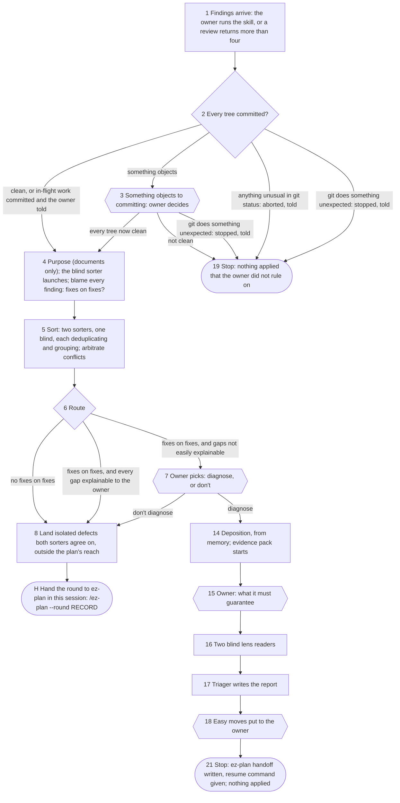

# The contract

What `triage-review` does, what it writes, and who may never see what. The rules it shares with
`ez-plan` — the unit, the tree and git stops, agents, the groups, the sort, questions, records and
commits — are in `references/shared.md` and cited by ID; the diagnosis route's own rules are in
`references/diagnose.md`. The step files carry out all three; where a step file disagrees with
any of them, the step file is the defect. Keeping this file accurate and free of
conflict with the skill is a standing obligation, not a tie-break used after the fact.

## What it is for

It decides who reads a review's findings. Two sorters, one blind, and an arbitrator rule on every
finding, so the owner does not have to read them; trivial defects both sorters agree on land at
once; and the rest is handed to `ez-plan`, which puts the decisions to the owner — or, where fixes
keep landing on fixes over a hole nobody named, the loop is diagnosed instead. It exists for review
work; general planning is `ez-plan`'s alone.

## The flow

Diamonds are the skill's decisions; hexagons are forks the owner decides. Nodes 9-13 and 20 are
unused; the handover is `H`.

Nodes 2 and 3 are `references/shared.md` G1. Questions 3 and 7, and node 4's question on a Claude
Artifact, are about process; asking them before the deposition does not contaminate it. The only
questions about the artifact are 15 and 18, under `references/diagnose.md`, *Diagnosis questions*.

## The rules

**Entry**
- **E1.** The skill starts on its own only when a review returns more than four findings. At four
  or fewer the owner triages them, and runs the skill if they want help.

**Router**
- **R1.** Fixes on fixes is a relation with two ends — this round's findings landing in an earlier
  round's fixes — and both are checked.
  - **The findings' end.** Findings are a review of the work only where they came from one.
    Findings that are **new work against existing code** — a bug tracker's issues, a feature list,
    a report from outside the project — are not fixes on fixes whatever blame reaches. The round
    section of `sort.md` says which it was, in one sentence.
  - **The fixes' end.** A finding is fixes on fixes when blame on its lines, in the member that
    holds them, reaches a commit with a `Review-round:` trailer or a message saying it applied
    review findings, **and that commit wrote those lines** rather than only moving them. A commit
    whose diff deletes a line at one place and adds it at another did not write it. A
    `Work-plan:` commit is not a review fix.
  - **The owner's rulings are not fixes.** A commit that only records the owner's words —
    `owner.md`, `owner-late.md`, anything under a run's `RECORD`, a file of rulings — is not fixes
    on fixes, whatever its trailer or message says. A commit mixing a ruling with a fix counts only
    where blame reaches the fix.
- **R3.** The findings are numbered as received, and purpose is stated as `references/shared.md` S1
  says. Two sorters, one blind, each deduplicate them — the same claim reported twice becomes one
  item — and put each item in a group, naming the numbered findings it covers.
  - **The blind sorter** is launched before blame, as soon as `findings.md` exists and purpose is
    stated. It sorts only — no blame, no purpose — and writes `sort-b.md` itself instead of
    returning its sort.
  - **One arbitrator breaks every tie in the round**, launched once, on three conflicts: whether a
    finding is valid, whether two findings are one, and whether an implementation defect is isolated
    or a pattern. It settles validity for every tied item first, then the action axis — the covers
    split, and isolated versus pattern — skipping the action question on anything it invalidated.
  - Per tie, the arbitrator is given only the `sort-a.md` / `sort-b.md` entries covering that tie's
    findings; across ties, the union of those and nothing else of either reading. It says what it
    rested on per tie, and each ruling rests on evidence from the artifact, never on the other
    sorter's record across ties.
  - It may spawn its own reader **for depth, not for count**, reserved for a tie that needs a lot
    of code or docs read; one arbitrator is the default. The reader is launched under the same rules
    as any agent here (`references/shared.md` A), is given only what that tie was given, and its
    reply returns verbatim and attributed.
  - Every other disagreement is carried in `sort.md` verbatim, for `ez-plan` to report.
  - **Both sorters and the arbitrator are given the written criteria**: each `--spec`, and each
    `plan.md` that a `Work-plan:` trailer in the reviewed range names (`references/shared.md` C).
    The work was built against them, so they are not an earlier reading of the findings.
- **R4.** No fixes on fixes → land, then hand over. Fixes on fixes → the skill developer's question
  decides: *"are there assumptions or inconsistencies in the codebase, created during the last
  fix round, which aren't easily explainable or summarizable to a human?"*
  - **No** — the owner can fill the gaps, and they are known → land, then hand over, without asking;
    `sort.md`'s route says it was fixes on fixes and why no diagnosis was needed.
  - **Yes** — inconsistencies, many hidden assumptions, or rot patterns → ask the owner: diagnose,
    or don't, recommending diagnose. The question keeps its altitude, and its answer goes to
    `sort.md`.

**Landing and handing over**
- **P1.** A fix lands before the handover only when both sorters called it valid and an isolated
  defect, and it is outside **the plan's reach** — the skill developer's question: *"Is this fix
  likely to be rewritten or invalidated by the plan?"* Size does not decide it: a fix in a huge file
  such as an API client lands; one in a tangled web of calls the last round implicated does not.
  Anything that
  needed the arbitrator is marked **"don't fix early"**, like an item inside that reach, whatever
  the arbitrator ruled. Each lands in the member that holds its lines, under
  `references/shared.md` C with `Review-round:`, and is recorded in `sort.md`'s *what landed*
  (`references/shared.md` S2). Independent bounded verification follows `references/codemap-workflow.md`; this is repair verification, not another review round.
- **H.** After landing, the skill hands the round to `ez-plan` **in the same session** — `/ez-plan
  --round RECORD`, passing on every `--spec` it was given — and stops. `ez-plan` summarises it,
  decides with the owner whether anything is left for a plan, and plans, discusses or hands off.
  This skill writes no summary, asks no planning question, and writes no `plan.md` of its own.

**Diagnose** — `D1`-`D8` and the diagnosis questions are in `references/diagnose.md`.

**The unit, beyond the shared rules** (`references/shared.md` U). Node 2, blame, the checkpoint, the
evidence pack and the readers' windows cover every member; the report, earlier runs and earlier
reports live in the primary. **Each `--test` path goes only to the members that hold it**, at its
checkpointed head; a `--spec` path goes to a member holding it at its window base or head. A member
no `--test` names finds its own tests. A member has its own checkpoint tag and window. Uncommitted
changes are node 2's to commit and the checkpoint's to refuse (`references/diagnose.md` D6), and
`checkpoint.py` refuses anything unusual as `references/shared.md` U does.

**For a versioned Artifact:**
- **The replay.** Its versions are replayed into a fresh git repository in a temporary directory
  (`mktemp -d`), one commit per version, message its label or `unlabelled`. A version is dated by
  its publish time where the session holds one; otherwise by the nearest later time it holds,
  keeping the order, and that commit's message says `publish time not held`. That repository is
  `REPO` for blame, the evidence pack and the readers' window. No way to fetch past versions is
  assumed: the versions come from what the authoring session holds — files it published, its
  conversation, a handoff file — plus the live version from the Artifact tool's `read`. Using the
  session's own context as the source of the versions is not the transcript route. A version not
  held is named in `sort.md` as not held, the gap is noted in the next replayed commit's message,
  and it is treated like an unlabelled version. The replay's window base, where `--since` does not
  give one, is its first commit, v1, stated and not asked.
- **No tree.** Node 2 does not apply.
- **Fixes on fixes, per version**, from its label, the session's record or a handoff file; failing
  those, inferred from the versions and the context held. `sort.md` says per version which it rested
  on, inferred ones marked. Where an inferred call alone decides whether the round is fixes on
  fixes, it is put to the owner at node 4 as a process question, and the question and answer go
  verbatim into `sort.md` under the round.
- **A trivial fix** lands as a new published version of the same Artifact — read first, then
  published to its URL — its label saying it applies findings from the run (`references/shared.md`
  C).

## The files

`RECORD` is placed as `references/shared.md` K1 says, and committed or ignored as K2 says; for this
skill, record commits are also the only thing that may move a member's `HEAD` under a run
(`references/diagnose.md` D6).
**The report is written into the primary's working tree** — a `CLAUDE.md` override does not move it
— or `./POSTMORTEM-<YYYY-MM-DD>-<slug>.md` in the current directory on a versioned Artifact run outside
git.

"Never shown to" means the reader is not given the file and is told not to open it. Every reader
says where each of its claims came from; that is the check.

**1. A reading, verbatim.** Never shown to: the lens readers, except their own; the triager, the
findings and both raw sorts.
- `findings.md` (`references/shared.md` S2).
- `sort-a.md` (the session's own sort), `sort-b.md` (the blind sort), `arbitration.md` (the
  arbitrator's reply, a heading per tie).
- `evidence/` and `evidence-summary.txt`; `lens-a.md`, `lens-b.md`.

**2. The sort** — `sort.md` (`references/shared.md` S2). Never shown to: the lens readers, the blind
sorter, the arbitrator. This skill writes 7's answer verbatim in it, with the route and why, and
node 4's process question and answer on a versioned Artifact.

**3. The owner's words, verbatim** (`references/shared.md` K3). The lens readers get `owner.md` and
nothing else of these. Answers after the lens readers launch go in `owner-late.md`; 18's are
appended to the report as §11. Node 3 is preflight and is written nowhere.

**4. A deliverable.** `deposition.md` (14), the report (17). The lens readers never see the
deposition.
